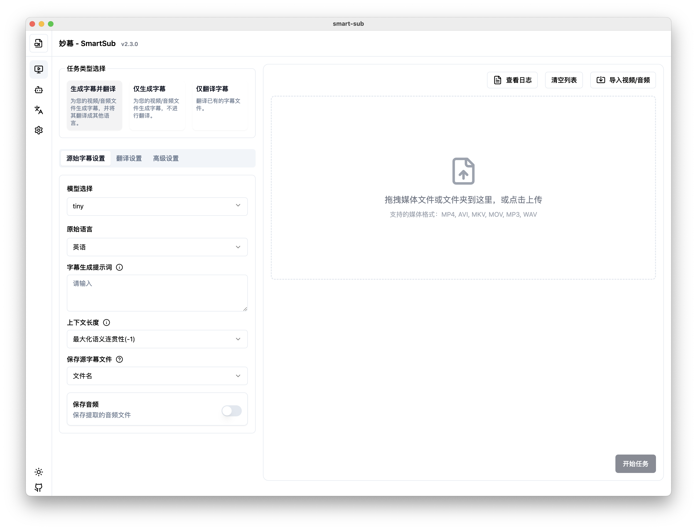

# video-subtitle-master

[English](./README_EN.md) | 中文

批量为视频生成字幕，并可将字幕翻译成其它语言。这是在之前的一个开源项目 [VideoSubtitleGenerator](https://github.com/buxuku/VideoSubtitleGenerator) 的基础上，制作成的一个客户端工具，以方便更多朋友们的使用。



## 关于 CUDA 的支持

因为本人使用的是苹果芯片，缺少 window CUDA 的开发环境，对于 CUDA 的支持，开发测试都存在较多场景无法兼顾的情况。

- 目前提供了 CUDA 11.8.0 和 12.2.0 及 12.4.1 版本的编译，是通过 github action 自动编译的，可能存在环境的兼容问题
- 要启用 CUDA，需要确定自己的电脑支持 CUDA, 并安装了 CUDA toolkit. [CUDA download](https://developer.nvidia.com/cuda-downloads)
- CUDA toolkit 的版本理论上是向后兼容，请根据你显卡支持的版本，选择合适的版本

## 关于 Core ML 的支持

从 1.20.0 版本开始，在苹果芯片上，支持使用 Core ML 加速语音识别。如果是苹果芯片，请下载 mac arm64 版本的 release 包。将会自动启动 Core ML 加速。

## 💥特性

它保留了之前 [VideoSubtitleGenerator](https://github.com/buxuku/VideoSubtitleGenerator) 这个命令行工具的全部特性，并新增了以下功能:

- 图形用户界面，操作更加便捷
- 源语言字幕文件和目标语言字幕文件放在视频同目录下，方便播放时任意挂载字幕文件
- 批量处理视频/音频/字幕文件
- 支持视频/音频生成字幕
- 支持对生成的字幕，或者导入的字幕进行翻译
- 支持多种翻译服务:
  - 火山引擎翻译
  - 百度翻译
  - DeepLX 翻译 （批量翻译容易存在被限流的情况）
  - 本地模型 Ollama 翻译
  - 支持 OpenAI 风格 API 翻译，如 [deepseek](https://www.deepseek.com/), [azure](https://azure.microsoft.com) 等
- 自定义字幕文件名，方便兼容不同的播放器挂载字幕识别
- 自定义翻译后的字幕文件内容，支持纯翻译结果或原字幕+翻译结果
- 项目集成 `whisper.cpp`，对 Apple Silicon 进行了优化，有较快的生成速度
- 项目集成了 `fluent-ffmpeg`，无须单独安装 `ffmpeg`
- 支持运行本地安装的 `whisper` 命令
- 支持选择模型下载源（国内镜像源或官方源）
- 支持自定义并发任务数量


## 翻译服务

本项目支持多种翻译服务，包括百度翻译、火山引擎翻译、DeepLX、Ollama 本地模型以及 OpenAI 风格的 API。使用这些服务需要相应的 API 密钥或配置。

对于百度翻译、火山引擎等服务的 API 申请方法，可以参考 https://bobtranslate.com/service/ ，感谢 [Bob](https://bobtranslate.com/) 这款优秀的软件提供的信息。

## 🔦使用 (普通用户)

请根据自己的电脑系统，芯片，显卡，选择下载对应安装包。

- 带 *generic* 的版本，是通用的版本，理论上支持常见的显卡
- 带 *optimized* 的版本，是优化版本，提供了针对各个系列显卡的优化，理论上兼容性更强

| 系统 | 芯片 | 显卡 | 下载安装包 |
| ---- | ---- | ---- | ---- |
| Windows | x64 | CUDA >= 11.8.0 < 12.0.0 | windows-x64_cuda11.8.0 |
| Windows | x64 | CUDA >= 12.4.1 | windows-x64_cuda12.4.1 |
| Windows | x64 | CUDA >= 12.2.0 | windows-x64_cuda12.2.0 |
| Windows | x64 | 无 CUDA | windows-x64_no_cuda |
| Mac | Apple | 支持 CoreML | mac-arm64 |
| Mac | Intel | 不支持 CoreML | mac-x64 |

1. 前往 [release](https://github.com/buxuku/video-subtitle-master/releases) 页面根据自己的操作系统下载安装包
2. 安装并运行程序
3. 在程序中配置所需的翻译服务
4. 选择要处理的视频文件或字幕文件
5. 设置相关参数（如源语言、目标语言、模型等）
6. 开始处理任务

## 🔦使用 (开发用户)

1️⃣ 克隆本项目在本地

```shell
git clone https://github.com/buxuku/video-subtitle-master.git
```

2️⃣ 在项目中执行 `yarn install` 或者 `npm install`

```shell
cd video-subtitle-master
yarn install 
```

3️⃣ 依赖包安装好之后，执行 `yarn dev` 或者 `npm run dev` 启动项目

```shell
yarn dev
```

## 手动下载和导入模型

因为模型文件比较大，如果通过该软件下载模型会存在难以下载的情况，可以手动下载模型并导入到应用中。以下是两个可用于下载模型的链接：

1. 国内镜像源（下载速度较快）：
   https://hf-mirror.com/ggerganov/whisper.cpp/tree/main

2. Hugging Face 官方源：
   https://huggingface.co/ggerganov/whisper.cpp/tree/main

如果是苹果芯片，需要同时下载模型对应的 encoder.mlmodelc 文件。并解压出来放在模型相同目录下。

下载完成后，您可以通过应用的"模型管理"页面中的"导入模型"功能将下载的模型文件导入到应用中。或者直接复制到模型目录里面即可。

导入步骤：
1. 在"模型管理"页面中，点击"导入模型"按钮。
2. 在弹出的文件选择器中，选择您下载的模型文件。
3. 确认导入后，模型将被添加到您的已安装模型列表中。

## 常见问题

##### 1.提示应用程序已损坏，无法打开。
在终端中执行以下命令：

```shell
sudo xattr -dr com.apple.quarantine /Applications/Video\ Subtitle\ Master.app
```
然后再次运行应用程序。

## 贡献

👏🏻 欢迎提交 Issue 和 Pull Request 来帮助改进这个项目！

👨‍👨‍👦‍👦 如果有任何使用问题，也欢迎来这里交流:


## 许可证

本项目采用 MIT 许可证。详情请见 [LICENSE](LICENSE) 文件。

## Star History

[](https://star-history.com/#buxuku/video-subtitle-master&Date)
