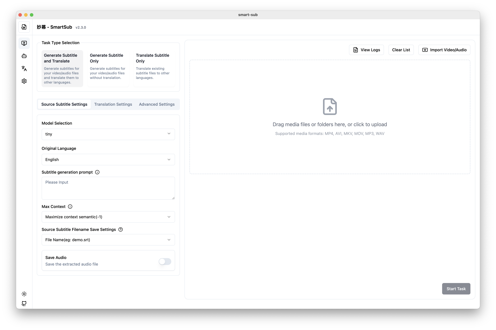

# 🚀 妙幕 / SmartSub

<div align="center">

[](https://github.com/buxuku/SmartSub/releases/latest)
[](https://github.com/buxuku/SmartSub/blob/master/LICENSE)
[](https://github.com/buxuku/SmartSub/stargazers)

[ 🇨🇳 中文](README.md) | [ 🌏 English](README_EN.md)

</div>

**Make every frame speak beautifully**

Smart subtitle generation and multilingual translation solution for video/audio files.



## 💥 Features

This application retains all the features of the original [VideoSubtitleGenerator](https://github.com/buxuku/VideoSubtitleGenerator) command-line tool, with the following enhancements:

- Batch processing of video/audio/subtitle files
- Ability to translate generated or imported subtitles
- Localized processing, no need to upload videos, protecting privacy while also having faster processing speeds
- Multiple translation services supported:
  - Volcano Engine Translation
  - Baidu Translation
  - Microsoft Translator
  - DeepLX Translation (Note: Batch translation may be rate-limited)
  - Local Ollama model translation
  - AI aggregation platform [DeerAPI](https://api.deerapi.com/register?aff=QvHM)
  - Support for OpenAI-style API translations (e.g., [deepseek](https://www.deepseek.com/), [azure](https://azure.microsoft.com/))
- **🎯 Custom Parameter Configuration**: Configure AI model parameters directly in the UI without code modification
  - [v2.5.3-release-brief.md](./Changelog/v2.5.3-release-brief.md)
  - Support custom HTTP headers and request body parameters
  - Support multiple parameter types (String、Float、Boolean、Array、Object、Integer)
  - Real-time parameter validation with error feedback
  - Configuration export/import functionality
- Customizable subtitle file naming for compatibility with various media players
- Flexible translated subtitle content: choose between pure translation or original + translated subtitles
- Hardware acceleration is supported
  - NVIDIA CUDA (Windows/Linux)
  - Apple Core ML (macOS M series chip)
- Support for running locally installed `whisper` command
- Customizable number of concurrent tasks

## About CUDA support

Because I use an Apple Silicon chip, I lack a Windows CUDA development environment. For CUDA support, there are many scenarios that are difficult to cover both in development and testing.

- Currently, CUDA 11.8.0 and 12.4.1 versions are provided through GitHub Actions, which may have compatibility issues with the environment
- To enable CUDA, you need to determine if your computer supports CUDA and has installed the CUDA toolkit. [CUDA download](https://developer.nvidia.com/cuda-downloads)
- The version of the CUDA toolkit theoretically supports backward compatibility. Please choose the appropriate 11.8.0 or 12.4.1 version based on your graphics card support
- If you have problems downloading generic usage, you can download optimized Version, which is optimized for better compatibility across a variety of graphics card families

## Core ML support

Starting from version 1.20.0, Core ML is supported on Apple Silicon, providing faster speech recognition. If you are using an Apple Silicon chip, please download the mac arm64 version of the release package. It will automatically enable Core ML acceleration.

## Translation Services

This project supports various translation services, including Baidu Translation, Volcano Engine Translation, DeepLX, local Ollama models, DeepSeek and OpenAI-style APIs. Using these services requires the appropriate API keys or configurations.

For information on obtaining API keys for services like Baidu Translation and Volcano Engine, please refer to https://bobtranslate.com/service/. We appreciate the information provided by [Bob](https://bobtranslate.com/), an excellent software tool.

For AI translation, the translation results are heavily influenced by models and prompt words, so you can try different models and prompt words to find the right combination for you. Recommended to try AI aggregation platform [DeerAPI](https://api.deerapi.com/register?aff=QvHM), nearly 500 kinds of model to support multiple platforms, choose appropriate model for translation.

### Custom Parameter Configuration (v2.5.3)

SmartSub now supports configuring custom parameters for each AI translation service, allowing you to precisely control model behavior:

- **Flexible Parameter Setup**: Add and manage custom parameters directly in the interface without code modification
- **Parameter Type Support**: Supported "String、Float、Boolean、Array、Object、Integer" parameter types
- **Real-time Validation**: Real-time validation when modifying parameters to prevent invalid configurations
- **Configuration Management**: Support for exporting and importing configurations for team sharing and backup

## Model Selection

To generate subtitles from video or audio, you need to use the whisper model. Whisper models have different accuracies and processing speeds.

- Larger models have higher accuracy but require more powerful GPUs and slower processing speeds
- Lower-end devices or GPUs recommend using `tiny` or `base` models, which may have lower accuracy but faster processing speeds and smaller memory usage
- For mid-range devices, start with `small` or `base` models to balance accuracy and resource consumption
- For high-performance GPUs/workstations, use `large` models for higher accuracy
- If the original audio/video is in English, use models with `en` for optimized English processing
- If you care about model size, consider using `q5` or `q8` models, which offer smaller sizes at the cost of slightly reduced accuracy

## 🔦 Usage (For End Users)

Please download the appropriate package based on your computer's system, chip, and graphics card.

- The _generic_ version is a universal version that theoretically supports most graphics cards
- The _optimized_ version provides optimizations for various graphics card series, providing better compatibility

| System  | Chip  | Graphics Card           | Download Package       |
| ------- | ----- | ----------------------- | ---------------------- |
| Windows | x64   | CUDA >= 11.8.0 < 12.0.0 | windows-x64_cuda11.8.0 |
| Windows | x64   | CUDA >= 12.0.0          | windows-x64_cuda12.4.1 |
| Windows | x64   | CUDA >= 12.2.0          | windows-x64_cuda12.2.0 |
| Windows | x64   | no CUDA                 | windows-x64_no_cuda    |
| Mac     | Apple | support CoreML          | mac-arm64              |
| Mac     | Intel | no support CoreML       | mac-x64                |

1. Go to the [releases](https://github.com/buxuku/SmartSub/releases) page and download the appropriate package for your operating system
2. Or use the cloud disk [Quark](https://pan.quark.cn/s/0b16479b40ca) to download the corresponding version
3. Install and run the program
4. Download the model
5. Configure the desired translation services within the application
6. Select the video or subtitle files you want to process
7. Set relevant parameters (e.g., source language, target language, model)
8. Start the processing task

## 🔦 Usage (For Developers)

1️⃣ Clone the project locally

```shell
git clone https://github.com/buxuku/SmartSub.git
```

2️⃣ Install dependencies using `yarn install` or `npm install`

```shell
cd SmartSub
yarn install
```

If you are on Windows, or Mac intel platform, please download the node file from https://github.com/buxuku/whisper.cpp/releases/tag/latest and rename it to 'addon.node' and overlay it in the 'extraResources/addons/' directory.

3️⃣ After installing dependencies, run `yarn dev` or `npm run dev` to launch the project

```shell
yarn dev
```

## Manually Downloading and Importing Models

Due to the large size of model files, downloading them through the software may be challenging. You can manually download models and import them into the application. Here are two links for downloading models:

1. Domestic mirror (faster download speeds):
   https://hf-mirror.com/ggerganov/whisper.cpp/tree/main

2. Hugging Face official source:
   https://huggingface.co/ggerganov/whisper.cpp/tree/main

If you are using an Apple Silicon chip, you need to download the corresponding encoder.mlmodelc file. After downloading, you can import the model files into the application using the "Import Model" feature on the "Model Management" page.(If it is a q5 or q8 series model, there is no need to download this file)

After downloading, you can import the model files into the application using the "Import Model" feature on the "Model Management" page. Or you can directly copy the model files to the model directory.

Import steps:

1. On the "Model Management" page, click the "Import Model" button.
2. In the file selector that appears, choose your downloaded model file.
3. After confirming the import, the model will be added to your list of installed models.

## Common Issues

##### 1. "The application is damaged and can't be opened" message

Execute the following command in the terminal:

```shell
sudo xattr -dr com.apple.quarantine /Applications/SmartSub.app
```

Then try running the application again.

## Contributing

👏🏻 Issues and Pull Requests are welcome to help improve this project!

## Support

⭐ If you find this project helpful, feel free to give me a star, or buy me a cup of coffee (please note your GitHub account).

👨‍👨‍👦‍👦 If you have any use problems, welcome to join the wechat communication group, exchange and learn together.

| Alipay donation code                           | WeChat donation code                         | WeChat communication group                  |
| ---------------------------------------------- | -------------------------------------------- | ------------------------------------------- |
|  |  |  |

## License

This project is licensed under the MIT License. See the [LICENSE](LICENSE) file for details.

## Star History

[](https://star-history.com/#buxuku/SmartSub&Date)
