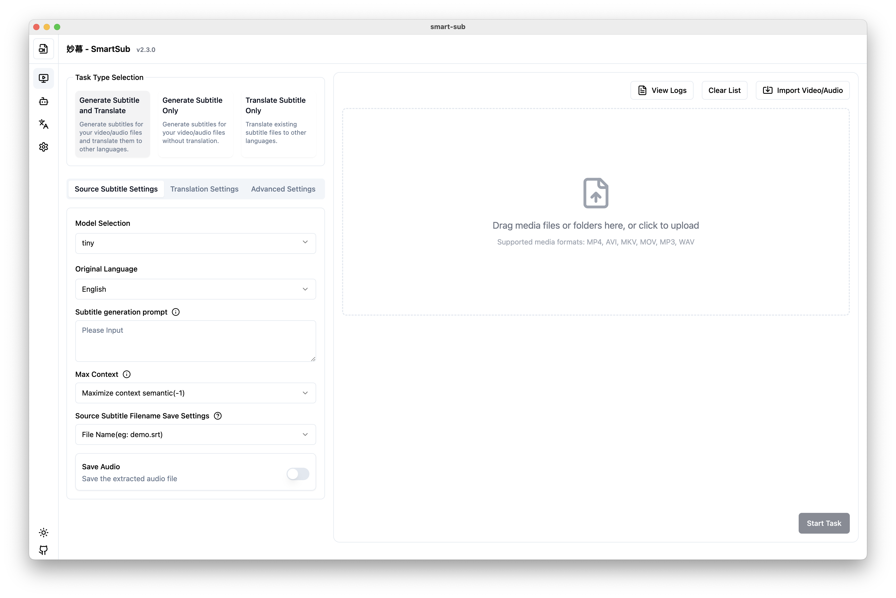

# 🚀 妙幕 / SmartSub

<div align="center">

<!-- 第1行：コアステータス - CI/バージョン/ライセンス/プラットフォーム -->

[](https://github.com/buxuku/SmartSub/actions/workflows/release.yml)
[](https://github.com/buxuku/SmartSub/releases/latest)
[](https://github.com/buxuku/SmartSub/blob/master/LICENSE)
[](https://github.com/buxuku/SmartSub/releases)
[](https://github.com/buxuku/SmartSub)

<!-- 第2行：機能 - モデル/翻訳サービス/ハードウェアアクセラレーション -->

[](https://github.com/openai/whisper)
[](https://github.com/buxuku/SmartSub#翻訳サービス)
[](https://developer.nvidia.com/cuda-downloads)
[](https://developer.apple.com/documentation/coreml)
[](https://github.com/buxuku/SmartSub)

<!-- 第3行：技術スタック -->

[](https://www.electronjs.org/)
[](https://nextjs.org/)
[](https://www.typescriptlang.org/)
[](https://react.dev/)
[](https://tailwindcss.com/)

<!-- 第4行：コミュニティ指標 -->

[](https://github.com/buxuku/SmartSub/releases)
[](https://github.com/buxuku/SmartSub/stargazers)
[](https://github.com/buxuku/SmartSub/network/members)
[](https://github.com/buxuku/SmartSub/issues)
[](https://github.com/buxuku/SmartSub/commits)

<br/>

[ 🇨🇳 中文](README.md) | [ 🌏 English](README_EN.md) | [ 🇯🇵 日本語](README_JA.md)

</div>

**すべてのフレームを美しく表現する**

動画/音声ファイル向けのスマート字幕生成・多言語翻訳ソリューション




## 💥 特徴

このアプリケーションは、オリジナルの [VideoSubtitleGenerator](https://github.com/buxuku/VideoSubtitleGenerator) コマンドラインツールのすべての機能を保持しつつ、以下の機能強化を行っています：

- 動画/音声/字幕ファイルの一括処理
- 生成された字幕またはインポートされた字幕の翻訳機能
- ローカル処理により、動画のアップロード不要でプライバシーを保護しながら高速処理を実現
- 複数の翻訳サービスをサポート：
  - 火山エンジン翻訳
  - 百度翻訳
  - Microsoft Translator
  - DeepLX 翻訳（注：一括翻訳ではレート制限される場合があります）
  - ローカル Ollama モデル翻訳
  - AI 統合プラットフォーム [DeerAPI](https://api.deerapi.com/register?aff=QvHM)
  - OpenAI スタイルの API 翻訳をサポート（例：[deepseek](https://www.deepseek.com/)、[azure](https://azure.microsoft.com/)）
- **🎯 カスタムパラメータ設定**: コードを変更せずに UI から直接 AI モデルのパラメータを設定可能
  - [v2.5.3-release-brief.md](./Changelog/v2.5.3-release-brief.md)
  - カスタム HTTP ヘッダーとリクエストボディパラメータをサポート
  - 複数のパラメータタイプをサポート（String、Float、Boolean、Array、Object、Integer）
  - リアルタイムパラメータ検証とエラーフィードバック
  - 設定のエクスポート/インポート機能
- 様々なメディアプレーヤーとの互換性のためのカスタム字幕ファイル命名
- 翻訳字幕内容の柔軟な設定：翻訳のみまたは原文＋翻訳を選択可能
- ハードウェアアクセラレーションをサポート
  - NVIDIA CUDA（Windows/Linux）
  - Apple Core ML（macOS M シリーズチップ）
- ローカルにインストールされた `whisper` コマンドの実行をサポート
- 同時実行タスク数のカスタマイズが可能

## CUDA サポートについて

本アプリケーションには GPU アクセラレーションパック管理機能が内蔵されており、CUDA Toolkit を手動でインストールする必要はありません。

- インストール後、「設定 → GPU アクセラレーション」でアプリが自動的に GPU を検出し、適切なアクセラレーションパックを推奨します
- 推奨されたパックをダウンロードするだけで GPU アクセラレーションが有効になります。対応バージョン：CUDA 11.8.0 / 12.2.0 / 12.4.0 / 13.0.2
- アクセラレーション有効後にクラッシュする場合は、別のバージョンに切り替えるか、GPU アクセラレーションを無効にしてください

## Core ML サポート

バージョン 1.20.0 から、Apple Silicon で Core ML がサポートされ、より高速な音声認識を提供します。Apple Silicon チップを使用している場合は、mac arm64 バージョンのリリースパッケージをダウンロードしてください。自動的に Core ML アクセラレーションが有効になります。

## 翻訳サービス

このプロジェクトは、百度翻訳、火山エンジン翻訳、DeepLX、ローカル Ollama モデル、DeepSeek、OpenAI スタイルの API など、様々な翻訳サービスをサポートしています。これらのサービスを使用するには、適切な API キーまたは設定が必要です。

百度翻訳や火山エンジンなどのサービスの API キー取得方法については、https://bobtranslate.com/service/ を参照してください。優れたソフトウェアツールである [Bob](https://bobtranslate.com/) が提供する情報に感謝します。

AI 翻訳では、翻訳結果はモデルとプロンプトに大きく影響されるため、様々なモデルとプロンプトを試して、自分に合った組み合わせを見つけることができます。AI 統合プラットフォーム [DeerAPI](https://api.deerapi.com/register?aff=QvHM) をお試しいただくことをお勧めします。複数のプラットフォームで約 500 種類のモデルをサポートしており、翻訳に適したモデルを選択できます。

### カスタムパラメータ設定 (v2.5.3)

SmartSub は各 AI 翻訳サービスのカスタムパラメータ設定をサポートしており、モデルの動作を精密に制御できます：

- **柔軟なパラメータ設定**: コードを変更せずにインターフェースから直接カスタムパラメータを追加・管理
- **パラメータタイプサポート**: String、Float、Boolean、Array、Object、Integer パラメータタイプをサポート
- **リアルタイム検証**: パラメータ変更時にリアルタイムで検証し、無効な設定を防止
- **設定管理**: チーム共有やバックアップのための設定エクスポート/インポートをサポート

## モデル選択

動画や音声から字幕を生成するには、whisper モデルを使用する必要があります。Whisper モデルには様々な精度と処理速度があります。

- より大きなモデルは精度が高いですが、より強力な GPU が必要で、処理速度が遅くなります
- ローエンドデバイスや GPU では、`tiny` または `base` モデルの使用をお勧めします。精度は低くなりますが、処理速度が速く、メモリ使用量が少なくなります
- ミッドレンジデバイスでは、`small` または `base` モデルから始めて、精度とリソース消費のバランスを取ってください
- 高性能 GPU/ワークステーションでは、より高い精度のために `large` モデルを使用してください
- 元の音声/動画が英語の場合は、英語処理に最適化された `en` 付きモデルを使用してください
- モデルサイズを気にする場合は、`q5` または `q8` モデルの使用を検討してください。精度がわずかに低下する代わりに、より小さなサイズを提供します

## 🔦 使用方法（エンドユーザー向け）

お使いのシステムとチップに基づいて適切なパッケージをダウンロードしてください。GPU アクセラレーションパックはインストール後にアプリ内でダウンロードできます。

| システム | チップ | ダウンロードパッケージ | 説明                                                                  |
| -------- | ------ | ---------------------- | --------------------------------------------------------------------- |
| Windows  | x64    | windows-x64            | NVIDIA ユーザーはアプリ内でアクセラレーションパックをダウンロード可能 |
| Mac      | Apple  | mac-arm64              | Core ML アクセラレーション自動有効                                    |
| Mac      | Intel  | mac-x64                | GPU アクセラレーション非対応                                          |
| Linux    | x64    | linux-x64              | NVIDIA ユーザーはアプリ内でアクセラレーションパックをダウンロード可能 |

### Homebrew でインストール（macOS）（推奨）

macOS ユーザーは Homebrew で素早くインストールでき、チップタイプ（Intel/Apple Silicon）に基づいて正しいバージョンが自動的にダウンロードされます：

```bash
# tap を追加（一度だけ必要）
brew tap buxuku/tap

# インストール
brew install --cask smartsub
```

アップグレードとアンインストール：

```bash
# 最新バージョンにアップグレード
brew upgrade --cask smartsub

# アンインストール
brew uninstall --cask smartsub
```

### 手動ダウンロード

1. [リリース](https://github.com/buxuku/SmartSub/releases)ページに移動し、お使いのオペレーティングシステム用の適切なパッケージをダウンロードします
2. または、クラウドディスク [Quark](https://pan.quark.cn/s/0b16479b40ca) を使用して対応するバージョンをダウンロードします
3. プログラムをインストールして実行します
4. モデルをダウンロードします
5. アプリケーション内で希望の翻訳サービスを設定します
6. 処理したい動画または字幕ファイルを選択します
7. 関連パラメータを設定します（例：ソース言語、ターゲット言語、モデル）
8. 処理タスクを開始します

## 🔦 使用方法（開発者向け）

1️⃣ プロジェクトをローカルにクローン

```shell
git clone https://github.com/buxuku/SmartSub.git
```

2️⃣ `yarn install` または `npm install` で依存関係をインストール

```shell
cd SmartSub
yarn install
```

Windows / Linux、または Mac Intel プラットフォームの場合は、https://github.com/buxuku/whisper.cpp/releases/tag/latest から node ファイルをダウンロードし、`addon.node` にリネームして `extraResources/addons/` ディレクトリに配置してください。

3️⃣ 依存関係をインストール後、`yarn dev` または `npm run dev` を実行してプロジェクトを起動

```shell
yarn dev
```

## モデルの手動ダウンロードとインポート

モデルファイルのサイズが大きいため、ソフトウェア経由でのダウンロードが困難な場合があります。モデルを手動でダウンロードしてアプリケーションにインポートできます。モデルをダウンロードするための 2 つのリンクがあります：

1. 国内ミラー（ダウンロード速度が速い）：
   https://hf-mirror.com/ggerganov/whisper.cpp/tree/main

2. Hugging Face 公式ソース：
   https://huggingface.co/ggerganov/whisper.cpp/tree/main

Apple Silicon チップを使用している場合は、対応する encoder.mlmodelc ファイルもダウンロードする必要があります。ダウンロード後、「モデル管理」ページの「モデルをインポート」機能を使用してモデルファイルをアプリケーションにインポートできます。（q5 または q8 シリーズのモデルの場合、このファイルをダウンロードする必要はありません）

ダウンロード後、「モデル管理」ページの「モデルをインポート」機能を使用してモデルファイルをアプリケーションにインポートできます。または、モデルファイルをモデルディレクトリに直接コピーすることもできます。

インポート手順：

1. 「モデル管理」ページで「モデルをインポート」ボタンをクリックします。
2. 表示されるファイルセレクタで、ダウンロードしたモデルファイルを選択します。
3. インポートを確認すると、モデルがインストール済みモデルリストに追加されます。

## よくある問題

##### 1. 「アプリケーションが破損しているため開けません」というメッセージ

ターミナルで以下のコマンドを実行してください：

```shell
sudo xattr -dr com.apple.quarantine /Applications/SmartSub.app
```

その後、アプリケーションを再度実行してみてください。

## 貢献

👏🏻 このプロジェクトの改善にご協力いただける Issue や Pull Request を歓迎します！

## サポート

⭐ このプロジェクトが役立つと思ったら、スターを付けていただくか、コーヒーをおごってください（GitHub アカウントを備考欄にご記入ください）。

👨‍👨‍👦‍👦 使用上の問題がある場合は、WeChat コミュニティグループに参加して一緒に交流・学習しましょう。

| Alipay 寄付コード                              | WeChat 寄付コード                            | WeChat コミュニティグループ                 |
| ---------------------------------------------- | -------------------------------------------- | ------------------------------------------- |
|  |  |  |

## ライセンス

このプロジェクトは MIT ライセンスの下でライセンスされています。詳細については [LICENSE](LICENSE) ファイルを参照してください。

## Star History

[](https://star-history.com/#buxuku/SmartSub&Date)
